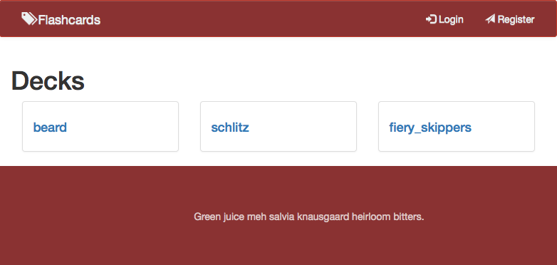
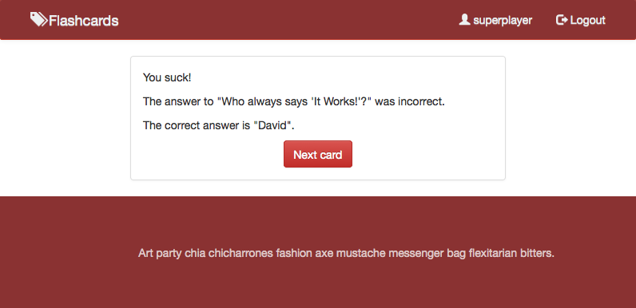

# Flashcards

Demo at http://fierycards.herokuapp.com/

## Team

* [@agurusa](https://github.com/agurusa)
* [@nbkhope](https://github.com/nbkhope)
* [@Tooconfident](https://github.com/Tooconfident)
* [@vic8722](https://github.com/vic8722)

## Overview

A web application that allows users to practice guessing the answer to
flashcards in a deck.

## Technologies

* HTML
* CSS
* Bootstrap
* Sinatra

## Screenshots

  
*Screenshot 1*.  Home page

  
*Screenshot 2*.  Registration

  
*Screenshot 3*.  Profile page

  
*Screenshot 4*.  Flashcard page

  
*Screenshot 5*.  Flashcard page when you give the wrong answer

## Installation

Run bundle to install all dependencies:

```
bundle install
```

Then, create, migrate, and seed the database:

```
bundle exec rake db:create db:migrate db:seed
```

If you already have the database, but want to drop it and start from scratch, run `bundle exec rake db:drop` before the command above.

Run the server using shotgun:

```
bundle exec shotgun config.ru
```

The app will be available at <http://localhost:9393>
