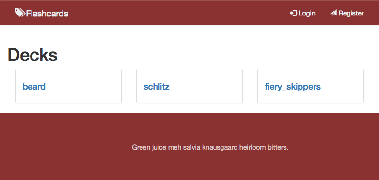
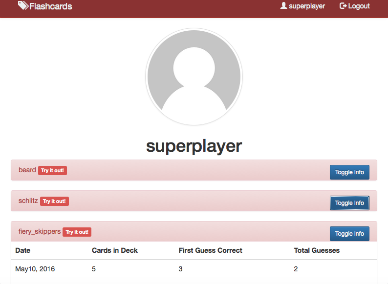
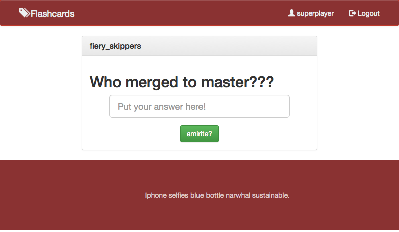
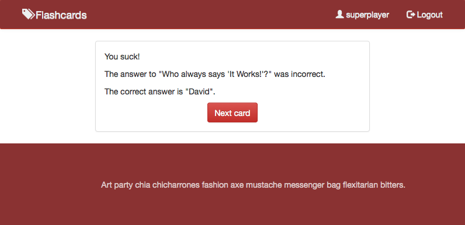

# Flashcards

Demo at http://fierycards.herokuapp.com/

## Team

* [@agurusa](https://github.com/agurusa)
* [@nbkhope](https://github.com/nbkhope)
* [@Tooconfident](https://github.com/Tooconfident)
* [@vic8722](https://github.com/vic8722)

## Overview

A web application that allows users to practice guessing the answer to 
flashcards in a deck.

## Technologies

* HTML
* CSS
* Bootstrap
* Sinatra

## Screenshots

*Screenshot 1*.  Home page

*Screenshot 2*.  Registration

*Screenshot 3*.  Profile page

*Screenshot 4*.  Flashcard page

*Screenshot 5*.  Flashcard page when you give the wrong answer
